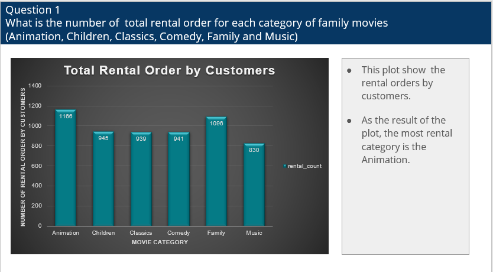
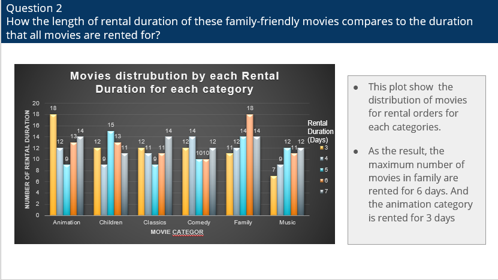
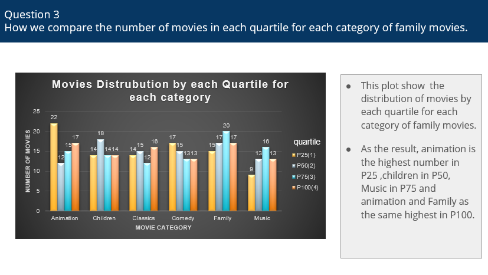
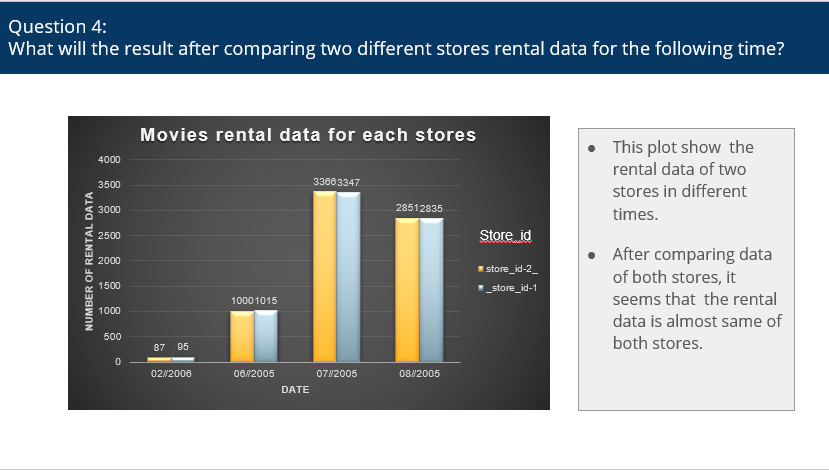

# SQL_project_Sakila-dvd-rental-database-analysis

# Introduction
In this project,we need to query the Sakila DVD Rental database. The Sakila Database holds information about a company that rents movie DVDs. For this project, you will be querying the database to gain an understanding of the customer base, such as what the patterns in movie watching are across different customer groups, how they compare on payment earnings, and how the stores compare in their performance. To assist you in the queries ahead, the schema for the DVD Rental database is provided below.

# The relationship between the tables
We need to use the table join skill to find what we want information.

# Questions to analysis
## Question 1

We want to understand more about the movies that families are watching. The following categories are considered family movies: Animation, Children, Classics, Comedy, Family and Music.

Create a query that lists each movie, the film category it is classified in, and the number of times it has been rented out.

## Question 2

Now we need to know how the length of rental duration of these family-friendly movies compares to the duration that all movies are rented for. Can you provide a table with the movie titles and divide them into 4 levels (first_quarter, second_quarter, third_quarter, and final_quarter) based on the quartiles (25%, 50%, 75%) of the rental duration for movies across all categories? Make sure to also indicate the category that these family-friendly movies fall into.

## Question 3

Finally, provide a table with the family-friendly film category, each of the quartiles, and the corresponding count of movies within each combination of film category for each corresponding rental duration category. The resulting table should have three columns:

- Category
- Rental length category
- Count

## Question 4

Write a query that returns the store ID for the store, the year and month and the number of rental orders each store has fulfilled for that month. Your table should include a column for each of the following: year, month, store ID and count of rental orders fulfilled during that month.

